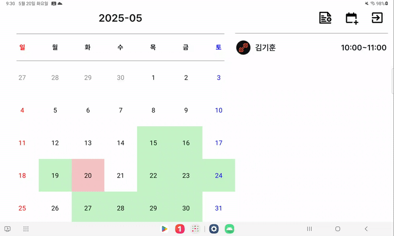
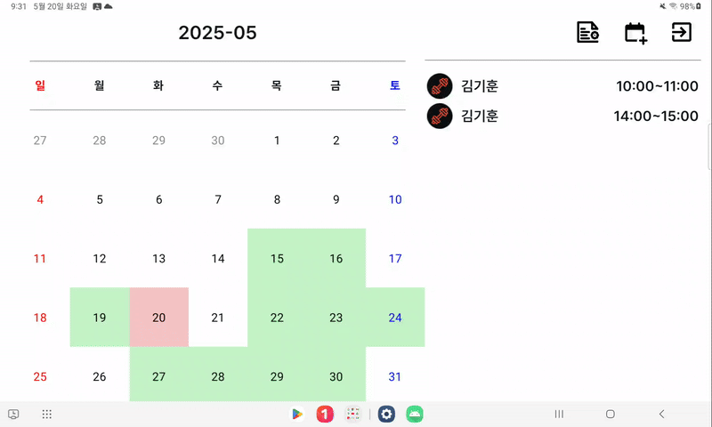
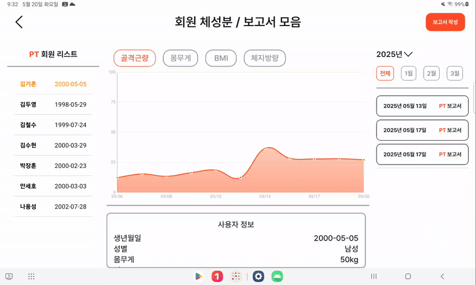
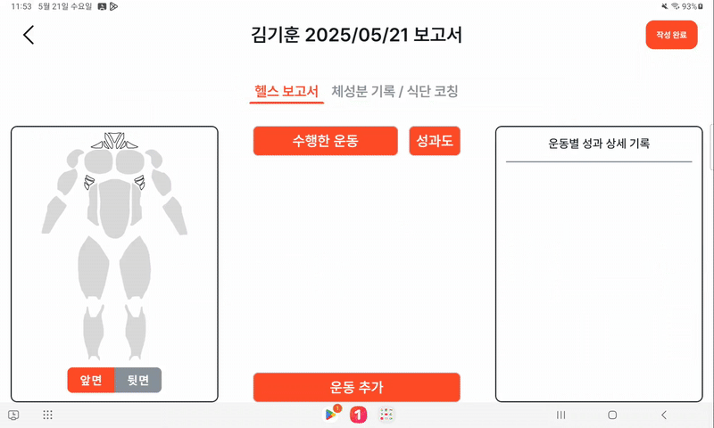
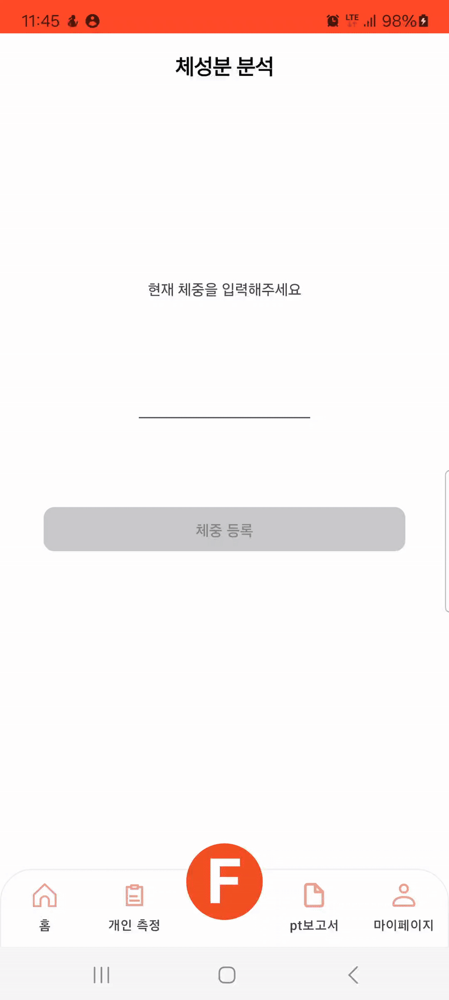
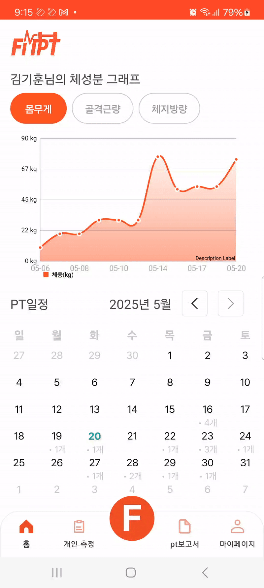
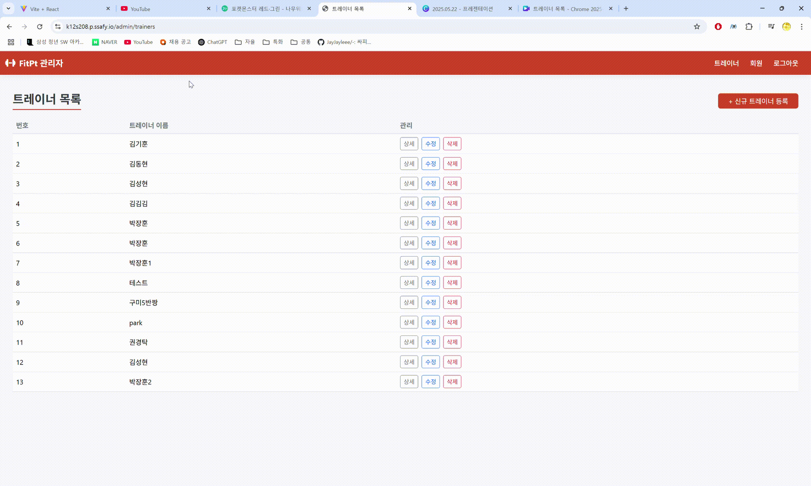
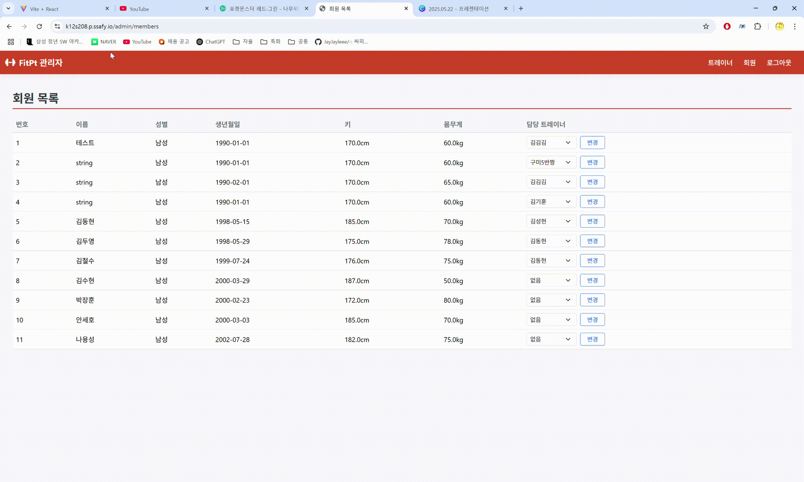
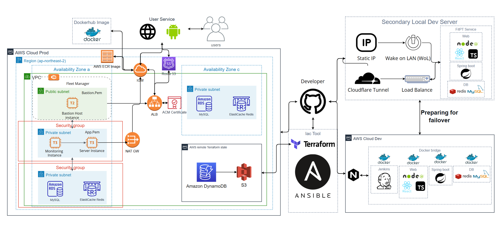
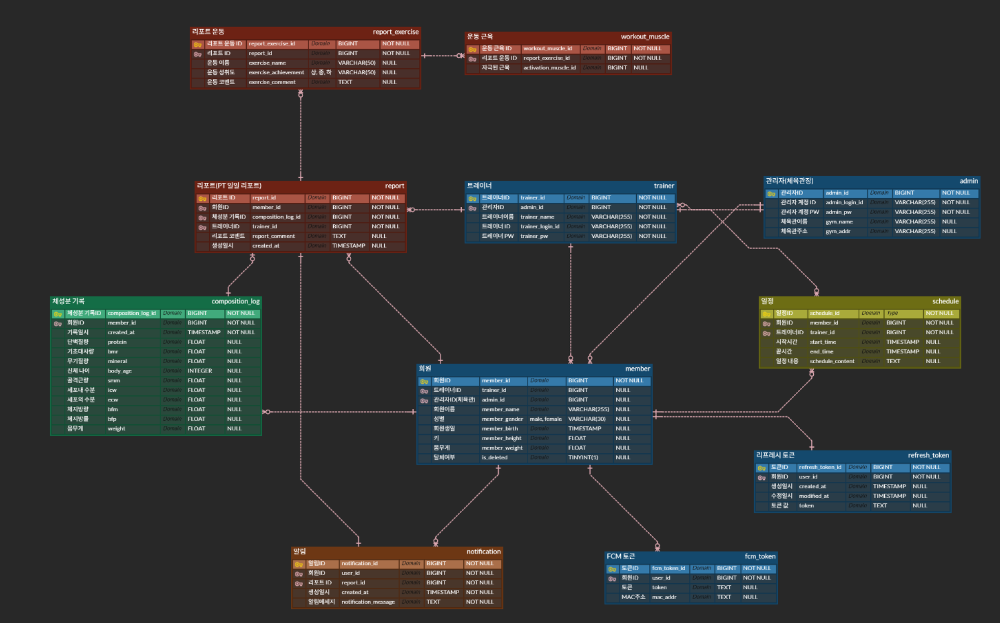

   
  

<h1>
<strong>FitPT</strong>
</h1>

  <strong>싸피 구미캠퍼스 12기 자율 기업연계 프로젝트</strong>

  헬스장 PT 회원 관리 플랫폼

  <h3>
    <a href="https://www.figma.com/design/nCvls64i3nnR49g3slzoQz/S208-%EC%95%84%EC%9D%B4%EB%94%94%EC%96%B4-%EA%B8%B0%ED%9A%8D?node-id=598-15077&t=SyG0liPQgLm5nZ5A-1">
      🖼️ Figma
    </a>
     | 
    <a href="https://www.canva.com/design/DAGn91uq860/z_4syOYCKgY1qSss_pMDCQ/view?utm_content=DAGn91uq860&utm_campaign=designshare&utm_medium=link2&utm_source=uniquelinks&utlId=heec8136fe6">
      🪞 소개 자료
    </a>
     | 
    <a href="https://gretea5.notion.site/Rest-API-1d7c0da1cd4680c99631ffa41ba89ee9">
      📜 API 명세서
    </a>
     | 
    <a href="https://gretea5.notion.site/1d7c0da1cd46805ca1a8d26b54abd6d3">
      📜 요구사항 명세서
    </a>
  </h3>

 

## 📍 목차

1. [**서비스 소개 및 기획배경**](#1)
1. [**기술 스택**](#2)
1. [**주요 기능**](#3)
1. [**프로젝트 구조**](#4)
1. [**영상 포트폴리오**](#5)
1. [**개발 팀 소개**](#6)
1. [**개발 기간 및 일정**](#7)

 

## 🕵️ 서비스 소개 및 기획배경

"운동한 부위, 무게, 트레이너 피드백… 아직도 종이에 적고 있나요?"
**Fitpt**는 바로 이 불편함에서 출발했습니다.
트레이너가 매번 종이에 운동 내용을 적고, 피드백을 수기로 남기던 기존 방식은

✔️ 번거롭고

✔️ 나중에 다시 확인하기도 어렵고

✔️ 관리도 비효율적이었습니다.

우리는 이런 비효율적인 방식에 의문을 품고, FitPT를 개발했습니다.
FitPT는 트레이너와 회원 모두를 위한 운동 기록 플랫폼입니다.

 

 

## 🛠 기술 스택

<table>
  <tbody>
    <tr>
      <td><strong>App</strong></td>
      <td>
        
        
      </td>
    </tr>
    <tr>
      <td><strong>Front-end</strong></td>
      <td>
        
      </td>
    </tr>
    <tr>
      <td><strong>Back-end</strong></td>
      <td>
        
        
        
        
        
        
      </td>
    </tr>
    <tr>
      <td><strong>DevOps</strong></td>
      <td>
        
        
        
        
      </td>
    </tr>
    <tr>
      <td><strong>DataBase</strong></td>
      <td>
        
        
      </td>
    </tr>
    <tr>
      <td><strong>Design</strong></td>
      <td>
        
      </td>
    </tr>
    <tr>
      <td><strong>협업도구</strong></td>
      <td>
        
        
        
        
        
      </td>
    </tr>
  </tbody>
</table>

 

 

## 📌 주요 기능

### 트레이너 앱

#### 1️⃣ 트레이너 일정

 

 

#### 2️⃣ 회원 체성분

 

#### 3️⃣ PT 보고서

 

### 사용자 앱

#### 1️⃣ 체성분 그래프

 

#### 2️⃣ 체성분 측정

 

#### 3️⃣ 체성분 정보

 

#### 4️⃣ PT 일정

 

#### 5️⃣ PT 보고서

 

### 관리자 웹

#### 1️⃣ 트레이너 관리

 

#### 2️⃣ 회원 관리

 

### 랜딩 웹

#### 1️⃣ 서비스 홍보

 

## 📁 프로젝트 구조

|                                    Architecture                                    |
| :--------------------------------------------------------------------------------: |
|  |

|                                    ERD                                    |
| :-----------------------------------------------------------------------: |
|  |

 

 

## 🎥 영상 포트폴리오

[**FitPT 영상 포트폴리오 바로가기**](https://youtu.be/2N8RxNAllYU?si=pZgSMSYyC_Fl471M)

 

## 🏅 개발 팀 소개

<table align="center">
  <tr>
    <td align="center" width="150px">
      
    </td>
    <td align="center" width="150px">
      
    </td>
    <td align="center" width="150px">
      
    </td>
    <td align="center" width="150px">
      
    </td>
    <td align="center" width="150px">
      
    </td>
    <td align="center" width="150px">
      
    </td>
  </tr>
  <tr>
    <td align="center">
        박장훈(팀장) App & BE
    </td>
    <td align="center">
        김기훈 App & UI/UX
    </td>
    <td align="center">
        김동현 App & UI/UX
    </td>
    <td align="center">
        권경탁 FE & Infra
    </td>
    <td align="center">
        김두영 FE & BE
    </td>
    <td align="center">
        안세호  BE
    </td>
  </tr>
</table>

 

 

## ⏰ 개발 기간 및 일정

### [4/14 ~ 4/20] PJT 1주차
- Notion 생성
- Jira 생성
- Convention 작성
- Code Convention 설정
- 기획 회의 진행

### [4/21 ~ 4/27] PJT 2주차
- API 명세서 작성
- ERD 구성
- App UI/UX 디자인(사용자 앱)

### [4/28~ 5/4] PJT 3주차
- App UI/UX 디자인(트레이너 앱)
- 사용자 App 개발(XML 작성)
- 백엔드 API 개발

### [5/5 ~ 5/11] PJT 4주차
- 트레이너 App 개발
- 사용자 App 개발(카카오 로그인, 측정 기능,FCM 기능)
- 백엔드 API 개발
- 관리자 웹페이지 제작

### [5/12 ~ 5/19] PJT 5주차
- 트레이너 App 개발(측정 기능,보고서 작성 기능)
- 사용자 App 개발(캘린더 기능)
- 랜딩페이지 제작

### [5/19 ~ 5/22] PJT 6주차
- 발표 자료 제작
- 자체 QA 진행
>>>>>>> README.md
