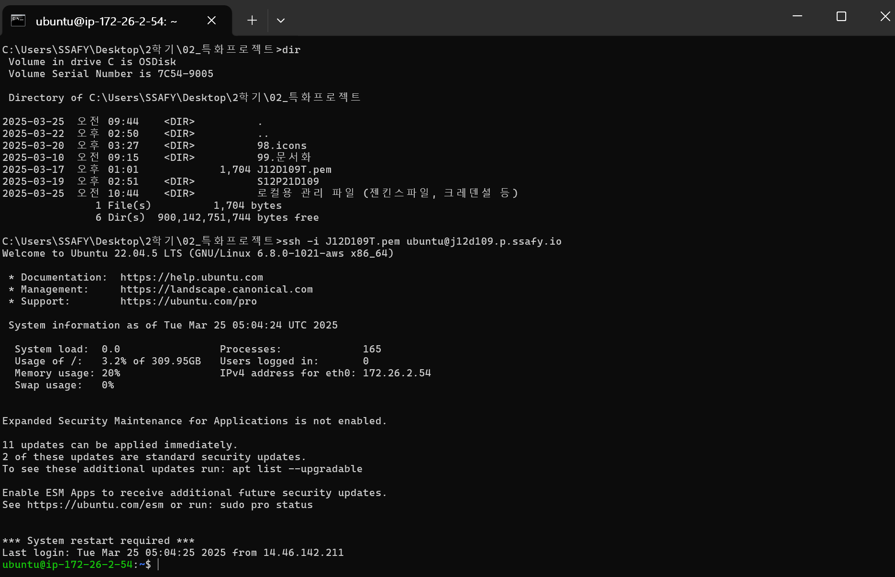

# 01-Docker DooD 방식 CI/CD 인프라 구축 과정

---

# 빌드 배포 메뉴얼

## 1. 사전 준비 사항

### 1.1. EC2 서버 발급 및 초기 설정

```powershell
# 최신 패키지 정보 업데이트: Ubuntu 서버의 패키지 목록을 최신화
sudo apt update

# 보안 패치 적용: 기존에 설치된 패키지들을 최신 버전으로 업그레이드
sudo apt upgrade
```

### 1.2. pem키 설정 및 서버 접속  →  외부 로컬 PC 설정할 때 활용 (필수 아님)

1. .pem 파일 로컬에 저장

```powershell
#PowerShell
wsl --install -d Ubuntu
```

1. ubuntu 계정에 대한 비밀번호 설정

```powershell
sudo passwd
su root
```

1. 서버 접속

```powershell
#폴더 생성
mkdir .ssh

# 자신 경로에 pem키 있는지 확인
cd /mnt/c/Users/Bae/Desktop/ssafy/pem

#해당 경로로 복사
cp /mnt/c/Users/Bae/Desktop/ssafy/pem/J12D109T.pem ~/.ssh/

#권한 설정(읽기)
chmod 400 ~/.ssh/J12D109T.pem 

#서버 접속
ssh -i ~/.ssh/J12D109T.pem ubuntu@j12d109.p.ssafy.io
```

1. EC2 접속 화면



## **2. 리눅스 방화벽 설정**

- iptable 여부에 따라 바오하벽 자동으로 열릴 수 있음

### 2.1. 예시

```powershell
# 필수 포트 허용
sudo ufw allow 22    # SSH
sudo ufw allow 80    # HTTP
sudo ufw allow 443   # HTTPS
sudo ufw allow 3000  # WEB (Frontend)
sudo ufw allow 8081  # WAS (Backend)
sudo ufw allow 8080  # Jenkins
```

### 2.2. 필수 포트 허용하기

- **ufw 적용 순서 방법**
    
    ```powershell
    제공되는 EC2의 ufw(우분투 방화벽)는 기본적으로 활성화(Enable) 되어 있고,
    ssh 22번 포트만 접속 가능하게 되어 있습니다.
    
    포트를 추가할 경우 6번부터 참고하시고,
    처음부터 새로 세팅해 보실 경우에는 1번부터 참고하시기 바랍니다.
    
    1. 처음 ufw 설정 시 실수로 ssh접속이 안되는 경우를 방지하기 위해
       ssh 터미널을 여유있게 2~3개 연결해 놓는다.
    
    2. ufw 상태 확인
    $ sudo ufw status
    Status : inactive
    
    3. 사용할 포트 허용하기 (ufw inactive 상태)
    $ sudo ufw allow 22
    
    3-1 등록한 포트 조회하기 (ufw inactive 상태)
    $ sudo ufw show added
    Added user rules (see 'ufw status' for running firewall):
    ufw allow 22
    
    4. ufw 활성화 하기
    $ sudo ufw enable
    Command may disrupt existing ssh connections. Proceed with operation (y|n)? y
    
    4.1 ufw 상태 및 등록된 rule 확인하기
    $ sudo ufw status numbered
    Status: active
    
         To                         Action      From
         --                         ------      ----
    [ 1] 22                         ALLOW IN    Anywhere
    [ 2] 22 (v6)                    ALLOW IN    Anywhere (v6)
    
    5. 새로운 터미널을 띄워 ssh 접속해 본다.
    C:\> ssh -i 팀.pem ubuntu@팀.p.ssafy.io
    
    6. ufw 구동된 상태에서 80 포트 추가하기
    $ sudo ufw allow 80
    
    6-1. 80 포트 정상 등록되었는지 확인하기
    $ sudo ufw status numbered
    Status: active
    
         To                         Action      From
         --                         ------      ----
    [ 1] 22                         ALLOW IN    Anywhere
    [ 2] 80                         ALLOW IN    Anywhere
    [ 3] 22 (v6)                    ALLOW IN    Anywhere (v6)
    [ 4] 80 (v6)                    ALLOW IN    Anywhere (v6)
    
    6-2. allow 명령을 수행하면 자동으로 ufw에 반영되어 접속이 가능하다. 
    
    7. 등록한 80 포트 삭제 하기
    $ sudo ufw status numbered
    Status: active
    
         To                         Action      From
         --                         ------      ----
    [ 1] 22                         ALLOW IN    Anywhere
    [ 2] 80                         ALLOW IN    Anywhere
    [ 3] 22 (v6)                    ALLOW IN    Anywhere (v6)
    [ 4] 80 (v6)                    ALLOW IN    Anywhere (v6)
    
    7-1. 삭제할 80 포트의 [번호]를 지정하여 삭제하기
          번호 하나씩 지정하여 삭제한다.
    $ sudo ufw delete 4
    $ sudo ufw delete 2
    $ sudo ufw status numbered  (제대로 삭제했는지 조회해보기)
    Status: active
    
         To                         Action      From
         --                         ------      ----
    [ 1] 22                         ALLOW IN    Anywhere
    [ 2] 22 (v6)                    ALLOW IN    Anywhere (v6)
    
    7-2 (중요) 삭제한 정책은 반드시 enable을 수행해야 적용된다.
    $ sudo ufw enable
    Command may disrupt existing ssh connections. Proceed with operation (y|n)? y입력
    
    기타
    - ufw 끄기
    $ sudo ufw disable
    ```
    

**ufw 적용 후 ufw 상태**


## 3. 도커 설치 및 설정

**도커 공식 문서 참조 →**   https://docs.docker.com/engine/install/ubuntu/#install-using-the-repository

### 3.1. Docker 레포지토리 설치

```powershell
# 다음 명령을 실행하여 충돌하는 모든 패키지를 제거
for pkg in docker.io docker-doc docker-compose docker-compose-v2 podman-docker containerd runc; do sudo apt-get remove $pkg; done

# 시스템의 패키지 목록을 최신화
sudo apt-get update

# SSL 인증서와 curl 도구 설치 (보안 통신과 파일 다운로드에 필요)
sudo apt-get install ca-certificates curl

# Docker의 GPG 키를 저장할 디렉토리 생성 (권한: 0755)
sudo install -m 0755 -d /etc/apt/keyrings

# Docker의 공식 GPG 키를 다운로드 (패키지 인증에 사용)
sudo curl -fsSL https://download.docker.com/linux/ubuntu/gpg -o /etc/apt/keyrings/docker.asc

# 다운로드한 GPG 키를 모든 사용자가 읽을 수 있도록 권한 설정
sudo chmod a+r /etc/apt/keyrings/docker.asc
```

### 3.2. 레포지토리 추가

```powershell
# Docker 공식 레포지토리를 시스템의 소프트웨어 소스에 추가
# - arch=$(dpkg --print-architecture): 시스템 아키텍처 확인 (예: amd64)
# - VERSION_CODENAME: Ubuntu 버전 코드네임 (예: focal)
echo "deb [arch=$(dpkg --print-architecture) signed-by=/etc/apt/keyrings/docker.asc] https://download.docker.com/linux/ubuntu $(. /etc/os-release && echo "$VERSION_CODENAME") stable" | sudo tee /etc/apt/sources.list.d/docker.list > /dev/null
```

### 3.3. Docker 패키지 설치

```powershell
sudo apt-get install docker-ce docker-ce-cli containerd.io docker-buildx-plugin docker-compose-plugin
```

### 3.4. Docker 설치 확인 및 권한 설정

```powershell
# 현재 사용자를 docker 그룹에 추가
sudo usermod -aG docker $USER  
#변경사항 적용   
newgrp docker 
#권한 확인
groups 
`ubuntu adm dialout cdrom floppy sudo audio dip video plugdev netdev lxd docker`
```

## 4. Jenkins 설치

### 4.1. 호스트 특정 디렉토리에 마운트

```powershell
cd /home/ubuntu && mkdir jenkins-data
```

### 4.2. Jenkins Docker 컨테이너 기동

### 4.2.1 jenkins docker 할 때  --network app-network \ 네트워크 생성

```yaml
docker run -d \
  -v /home/ubuntu/jenkins-data:/var/jenkins_home \
  -v /var/run/docker.sock:/var/run/docker.sock \
  -v /home/ubuntu/docker/proxy:/proxy \
  -p 8080:8080 \
  -e JENKINS_OPTS="--prefix=/jenkins" \
  --group-add $(getent group docker | cut -d: -f3) \
  -e TZ=Asia/Seoul \
  --restart=on-failure \
  --name jenkins \
  --network app-network \
	jenkins/jenkins:lts-jdk17

  # jenkins/jenkins:2.501  ->  젠킨스 공식 사이트에서 최신버전 명시
  
  # -v 호스트의 /home/ubuntu/jenkins-data 디렉토리를 컨테이너의 /var/jenkins_home에 마운트
  # -v 호스트의 Docker 소켓을 컨테이너에 마운트
  # -v 호스트의 해당 폴더로 마운트
  # -e Jenkins의 URL 접두사를 '/jenkins'로 설정
  # -e Docker 명령어를 젠킨스 내에서 실행할 권한을 부여
  # -- 실패했을 경우 재시작
  # -- jenkins로 이름 지정
  # --network app-network  컨테이너를 app-network에 연결하여 nginx 등 다른 서비스와 통신 - bridge 로 묶기
  # -- JDK17버전을 명시적으로 지정
```

### 4.3. Jenkins 환경설정

```yaml
cd /home/ubuntu/jenkins-data
       
mkdir update-center-rootCAs
#Jenkins가 업데이트 센터에 접속할 때 사용할 SSL 인증서를 제공
wget https://cdn.jsdelivr.net/gh/lework/jenkins-update-center/rootCA/update-center.crt -O ./update-center-rootCAs/update-center.crt
#Jenkins가 기본 업데이트 센터 대신 Tencent 미러를 사용하도록 설정
sudo sed -i 's#https://updates.jenkins.io/update-center.json#https://raw.githubusercontent.com/lework/jenkins-update-center/master/updates/tencent/update-center.json#' ./hudson.model.UpdateCenter.xml
#그 후 재시작
sudo docker restart jenkins
```

### 4.4. config  보안 설정 확인

```yaml
vi config.xml
#true가 되어 있어야함
<useSecurity>true</useSecurity>
<securityRealm class="hudson.security.HudsonPrivateSecurityRealm">
<disableSignup>true</disableSignup>
```

### 4.5. Jenkins 초기 설정

**앞서 4.2에서 Jenkins를 도커 컨테이너로 띄웠음.**

1.  **[http://j12d109.p.ssafy.io:8080/jenkins/](http://j12d109.p.ssafy.io:8080/jenkins/) 접속**

1. **Install suggeted plugins : 초기 플러그인 모두 설치**


1. **Getting Started - 계정 생성**

계정명 : admin
암호 : 1234
이름 : d109
이메일주소 : [user@example.com](mailto:user@example.com) (실제 본인 이메일)


1. **초기 Jenkins URL은 주소 고정**
    1. **현재는 http 이지만 추후 nginx로 https 리다이렉션할 예정.**


1. **Jenkins plugin 설치하기**
    
    Generic Webhook Trigger Plugin
    
    GitLab API Plugin
    
    GitLab Plugin
    
    Stage View  →  배포 과정 쉽게 볼 수 있음
    

### 4.6. Jenkins 내 docker 명령어 실행

**DooD ( Docker outside of Docker ) 방식 적용**

→  jenkins 컨테이너 내부에서 EC2 Docker 데몬에 접근하는 방식

→  CI/CD 파이프라인 내에서 Docker 빌드 작업할 때 주로 사용됨.

**Jenkins 안에 Docker를 설치하기 위해서 Jenkins 컨테이너에 접속**

```yaml
docker exec -it -u root jenkins bash
```

**Jenkins 안에 Docker를 설치**

```yaml
# 필요한 패키지 설치
apt-get update
apt-get install -y \
    ca-certificates \
    curl \
    gnupg \
    lsb-release

# Docker의 공식 GPG 키 추가
mkdir -p /etc/apt/keyrings
curl -fsSL https://download.docker.com/linux/debian/gpg | gpg --dearmor -o /etc/apt/keyrings/docker.gpg

# Docker repository 설정
echo \
  "deb [arch=$(dpkg --print-architecture) signed-by=/etc/apt/keyrings/docker.gpg] https://download.docker.com/linux/debian \
  $(lsb_release -cs) stable" | tee /etc/apt/sources.list.d/docker.list > /dev/null
  
# 패키지 목록 업데이트
apt-get update

# Docker CLI만 설치
apt-get install -y docker-ce-cli
```

## 5. Jenkins, Gitlab 연동하기

### 5.1. Jenkins plugin 설치

Jenkins관리  →  Plugins 클릭 ( stage view 추가 )


### 5.2. Gitlab 연결 Personal Access Token 발급하기

**저장소 접근과 코드 체크아웃을 위해 사용됨.**

**GitLab과 Jenkins를 연결할 때는 GitLab 계정의 액세스 토큰을 사용해야 합니다. ( 프로젝트 토큰 X )**

**본인 계정 페이지  →  Edit profile  →  Access tokens**

- **Scopes (권한) 선택  →  전체 선택해도 무방함**
    - **api : GitLab API를 사용하여 프로젝트 및 리포지토리에 접근 가능 (필수)**
    - **read_repository : 저장소 읽기 권한 (Clone 가능)**
    - **write_repository : Jenkins가 리포지토리에 Push 권한이 필요할 경우 선택**

**깃랩 Access Token 발급한 화면**

- **Access Token ( Gitlab )**
    
    txo_ohx5VGDhCRmE-nJw
    


### 5.3. Gitlab 연결 Gitlab API Token 발급하기

**GitLab API와의 통합 기능( webhook, mr 등 )을 위해 사용됨.**

**대상 프로젝트 페이지  →  Settings  →  Access Tokens**

**토큰 생성 시 권한 설정 후 발급한다.**

### **5.4. Jenkins Credential 등록하기**

**Jenkins 관리 → Credentials → System → Global credentials → Add Credentials**

**발급한 2개의 토큰을 각각 등록한다.**

- **Personal Access Token (개인 액세스 토큰)**
    - Jenkins에서 등록 시 타입: "Username with password"
    - Username: GitLab 사용자 이름
    - Password: 발급받은 Personal Access Token
    - ID: 'account' (또는 원하는 식별자)

 **→  주로 저장소 접근 및 코드 체크아웃에 사용**

- **GitLab API Token (GitLab API 토큰)**
    - Jenkins에서 등록 시 타입: "GitLab API token"
    - API token: 발급받은 Project Access Token
    - ID: 'GitLab-API-Token' (또는 원하는 식별자)

 **→  주로 웹훅, Merge Request 처리 등 GitLab 플러그인의 기능에 사용**


**로컬 관리할 자격증명은 Secret file로 만들어 따로 등록함.**


### 5.5. Pipline 생성

**jenkins  : 새로운 item → pipeline**


- 고급  →  시크릿 토큰 생성  →  Generate 버튼을 클릭 후
    - jenkins secret token 생성

GitLab : 해당 프로젝트 → setting → webhook 

- URL과 jenkins Secret token 입력


### 5.6. Jenkins-Gitlab 연결 확인

1. **Jenkins에서 Gitlab연결 테스트**

**Jenkins관리  →  System  →  GitLab 섹션**


1. **GitLab에서 웹훅 테스트**

**GitLab 웹훅 페이지 하단 “Test” 클릭 후 이벤트 유형 선택**

**성공 화면**

