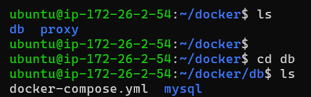

# 02-DB 및 Nginx (certbot) 웹 서버 컨테이너 구성

**EC2 내부 DB 관련 파일 경로**



**EC2 내부 Nginx 관련 파일 경로**


## 6. Mysql, Redis 컨테이너 기동

### 6.1. docker-compose.yml

```yaml
# EC2 내부 경로 : /home/ubuntu/docker/db/docker-compose.yml

services:
  mysql:
    image: mysql:8.0.40
    container_name: mysql
    restart: always
    environment:
      MYSQL_ROOT_PASSWORD: ${MYSQL_ROOT_PASSWORD}
      MYSQL_DATABASE: ${MYSQL_DATABASE}
      MYSQL_USER: ${MYSQL_USER}
      MYSQL_PASSWORD: ${MYSQL_PASSWORD}
    ports:
      - "3306:3306"
    volumes:
      - ./mysql/schema.sql:/docker-entrypoint-initdb.d/schema.sql
      - mysql_data:/var/lib/mysql
    command:
      - --character-set-server=utf8mb4
      - --collation-server=utf8mb4_unicode_ci
    healthcheck:
      test: ["CMD", "mysqladmin", "ping", "-h", "localhost"]
      interval: 10s
      timeout: 5s
      retries: 5
    networks:
      - app-network

  redis:
    image: redis:7
    container_name: redis
    ports:
      - "${REDIS_PORT}:6379"
    volumes:
      - redis_data:/data
    command: redis-server --requirepass '${REDIS_PASSWORD}' --appendonly yes
    networks:
      - app-network

volumes:
  mysql_data:
  redis_data:

networks:
  app-network:
    external: true
```

### 7.2 docker 명령어 실행

```yaml
#해당 폴더 위치로 이동
cd home/ubuntu/docker/db/docker-compose.yml

# 현재 디렉토리의 docker-compose.yml 파일 기반으로 서비스 시작
docker compose up -d

# 특정 docker-compose.yml 파일 지정하여 서비스 시작
docker compose -f docker-compose.yml up -d

# 현재 디렉토리의 docker-compose.yml 파일 기반으로 서비스 중지 및 삭제
docker compose down
```

### 7.3 DB init 설정하기

```yaml
#MYSQL 컨테이너 접속
docker exec -it mysql bash

#MYSQL에 root로 로그인
mysql -u root -p

#password 입력
monthlyzip#123

#권한 부여 명령어 실행
USE monthlyzip;
GRANT ALL PRIVILEGES ON monthlyzip.* TO 'monthlyzip'@'%;
FLSUH PRIVILEGES;

#확인하기
SHOW GRANTS FOR 'monthlyzip'@'%';
#나가기
exit;
```

## 7. NGINX 컨테이너 기동

### 7.1. docker-compose.yml

```yaml
# EC2 내부 경로 : home/ubuntu/docker/proxy/docker-compose.yml
services:
		nginx:
			image: nginx:latest
			container_name: nginx
			ports:          # 포트 매핑 (호스트:컨테이너)
				- "80:80"    # HTTP 트래픽용 포트
				- "443:443"  # HTTPS 트래픽용 포트
			volumes:       # 볼륨 마운트 (호스트 경로:컨테이너 경로)
	      - ./nginx.conf:/etc/nginx/nginx.conf
	      - ./conf.d:/etc/nginx/conf.d
	      - ./data/certbot/conf:/etc/letsencrypt    # SSL 인증서 저장 위치
	      - ./data/certbot/www:/var/www/certbot     # Let's Encrypt 인증 파일 위치
				- /home/ubuntu/inquiry/images:/var/www/inquiry/images  # 호스트 디렉토리와 마운트
	    command: "/bin/sh -c 'while :; do sleep 6h & wait $${!}; nginx -s reload; done & nginx -g \"daemon off;\"'"
			networks:
				- app-network
			restart: always
			
		certbot:
			image: certbot/certbot
			container_name: certbot
			volumes:
	      - ./data/certbot/conf:/etc/letsencrypt 
		    - ./data/certbot/www:/var/www/certbot
			networks:
				- app-network
	    entrypoint: "/bin/sh -c 'trap exit TERM; while :; do certbot renew; sleep 12h & wait $${!}; done;'"    

networks:
	app-network:        # app-network에 연결 (백엔드와 통신하기 위함)
		external: true    # 컨테이너가 종료되면 항상 재시작
```

## 8. CertBot Https 인증서 발급/적용

**CertBot 전용 발급 nginx.conf 작성  →   발급 후 완전한 nginx.conf 변경**

### 8.1. **CertBot 전용 발급 nginx.conf**

```coffeescript
# EC2 내부 경로 : home/ubuntu/docker/proxy/nginx.conf

user nginx;
worker_processes auto;
error_log /var/log/nginx/error.log warn;
pid /var/run/nginx.pid;

events {
    worker_connections 1024;
}

http {
    include /etc/nginx/mime.types;
    default_type application/octet-stream;
    
    # upstream 블록은 http 블록 내부에 있어야 함
    upstream backend {
        server monthlyzip-app:8081;
    }

    # server 블록도 http 블록 내부에 있어야 함
    server {
        listen 80;         # HTTP 포트 리스닝
        listen [::]:80;    # IPv6 지원
        server_name j12d109.p.ssafy.io;

        # Let's Encrypt 인증에 필요한 경로 설정
        # 이 경로를 통해 도메인 소유권 확인
        location /.well-known/acme-challenge/ {
            root /var/www/certbot;
        }

        # 모든 HTTP 요청을 HTTPS 리다이렉션
        location / {
            return 301 https://$server_name$request_uri;
        }
    }
}
```

### 8.2. 폴더 생성 및 권한 설정

```bash
# Certbot 관련 디렉토리 생성
mkdir -p data/certbot/conf  # 인증서가 저장될 경로
mkdir -p data/certbot/www   # 인증 챌린지 파일이 저장될 경로

# 디렉토리 소유권 및 권한 설정
sudo chown -R ubuntu:ubuntu data/certbot  # ubuntu 사용자로 소유권 변경
sudo chmod -R 755 data/certbot            # 읽기/쓰기 권한 설정 

# 인증서 발급 명령어 실행
# --webroot: 웹 서버 루트 경로 방식으로 인증
# -w: 웹 루트 디렉토리 지정
# -d: 인증서를 발급받을 도메인
# --force-renewal: 기존 인증서가 있어도 강제로 갱신
docker compose exec certbot certbot certonly --webroot -w /var/www/certbot -d j12d109.p.ssafy.io --agree-tos --email rlacjs546@gmail.com --force-renewal
Saving debug log to /var/log/letsencrypt/letsencrypt.log
```

### 8.3. Certbot 인증서 발급 완료

```coffeescript
ubuntu@ip-172-26-2-54:~/docker/proxy$ docker compose exec certbot certbot certonly --webroot -w /var/www/certbot -d j12d109.p.ssafy.io --agree-tos --email rlacjs546@gmail.com
Saving debug log to /var/log/letsencrypt/letsencrypt.log
Requesting a certificate for j12d109.p.ssafy.io

Successfully received certificate.
Certificate is saved at: /etc/letsencrypt/live/j12d109.p.ssafy.io/fullchain.pem
Key is saved at:         /etc/letsencrypt/live/j12d109.p.ssafy.io/privkey.pem
This certificate expires on 2025-06-18.
These files will be updated when the certificate renews.

NEXT STEPS:
- The certificate will need to be renewed before it expires. Certbot can automatically renew the certificate in the background, but you may need to take steps to enable that functionality. See https://certbot.org/renewal-setup for instructions.

- - - - - - - - - - - - - - - - - - - - - - - - - - - - - - - - - - - - - - - -
If you like Certbot, please consider supporting our work by:
 * Donating to ISRG / Let's Encrypt:   https://letsencrypt.org/donate
 * Donating to EFF:                    https://eff.org/donate-le
- - - - - - - - - - - - - - - - - - - - - - - - - - - - - - - - - - - - - - - -
```

### 8.4. 인증서 발급이 성공되면 SSL pem 파일 작성

```coffeescript
# Diffie-Hellman 파라미터 생성 (SSL 보안 강화)
# 2048비트 키를 사용하여 생성
openssl dhparam -out data/certbot/conf/ssl-dhparams.pem 2048
```

### 8.5. Nginx 작성 ( 최종본 )

```
# EC2 내부 경로 : home/ubuntu/docker/proxy/nginx.conf

user nginx;
worker_processes auto;                    # 서버 코어에 맞게 자동 설정
error_log /var/log/nginx/error.log warn;  # 에러 로그 설정
pid /var/run/nginx.pid;                   # PID 파일유지

events {
    worker_connections 1024;                # 동시 연결 수 설정
}

http {

    include /etc/nginx/mime.types;          # 미디어 타입 포함
    default_type application/octet-stream;  # 기본 타입 설정

    upstream backend {
        server monthlyzip-app:8081;
    }

    upstream frontend {
        server react:80;
    }

    # HTTP 서버 설정 (80 포트)
    server {
        listen 80;                              # HTTP 포트 리스닝
        listen [::]:80;                         # IPv6 지원
        server_name j12d109.p.ssafy.io;         # 도메인 이름 설정

        # Let's Encrypt 인증용 경로
        location /.well-known/acme-challenge/ {
                root /var/www/certbot;             # 인증 파일 저장 위치
        }

        # HTTP  ->  HTTPS 리다이렉션
        location / {
            return 301 https://$server_name$request_uri;  # 영구 리다이렉트
        }
    }

    # HTTPS 서버 설정 (443 포트)
    server {
        listen 443 ssl;                       # SSL 포트 리스닝
        listen [::]:443 ssl;                  # IPv6 지원
        server_name j12d109.p.ssafy.io;       # 도메인 이름 설정
        server_tokens off;                    # 서버 버전 정보 숨김

        # SSL 인증서 설정
        ssl_certificate /etc/letsencrypt/live/j12d109.p.ssafy.io/fullchain.pem;      # 인증서 체인
        ssl_certificate_key /etc/letsencrypt/live/j12d109.p.ssafy.io/privkey.pem;    # 개인 키
        include /etc/letsencrypt/options-ssl-nginx.conf;                             # SSL 옵션
        ssl_dhparam /etc/letsencrypt/ssl-dhparams.pem;

        # location = / {
        #     return 301 /app/;
        # }

        # 프론트 경로
        location /app/ {
            proxy_pass http://frontend;
            proxy_http_version 1.1;
            proxy_set_header Upgrade $http_upgrade;
            proxy_set_header Connection "upgrade";
            proxy_set_header Host $host;
            proxy_set_header X-Real-IP $remote_addr;
            proxy_set_header X-Forwarded-For $proxy_add_x_forwarded_for;
            proxy_set_header X-Forwarded-Proto $scheme;
        }

        # 스프링부트 애플리케이션으로 모든 요청 프록시 !!
        location /service/ {
            proxy_pass http://backend/api/;
            proxy_http_version 1.1;                      # HTTP 버전 설정
            proxy_set_header Upgrade $http_upgrade;      # WebSocket 지원
            proxy_set_header Connection "upgrade";       # WebSocket 연결 유지
            proxy_set_header Host $host;                 # 원본 호스트 전달
            proxy_set_header X-Real-IP $remote_addr;     # 클라이언트 IP 전달
            proxy_set_header X-Forwarded-For $proxy_add_x_forwarded_for;  # 포워딩 정보
            proxy_set_header X-Forwarded-Proto $scheme;  # 프로토콜 정보 전달
        }

        # 젠킨스 경로 설정 (/jenkins로 시작하는 요청)
        location /jenkins {
            proxy_pass http://jenkins:8080/jenkins;       # 젠킨스 컨테이너로 프록시
            proxy_http_version 1.1;                       # HTTP 버전 설정
            proxy_set_header Host $host;                  # 원본 호스트 전달
            proxy_set_header X-Real-IP $remote_addr;      # 클라이언트 IP 전달
            proxy_set_header X-Forwarded-For $proxy_add_x_forwarded_for;  # 포워딩 정보
            proxy_set_header X-Forwarded-Proto $scheme;   # 프로토콜 정보 전달

            # Jenkins 관련 추가 설정
            proxy_set_header X-Jenkins-Context "/jenkins";  # 젠킨스 컨텍스트 경로
            proxy_redirect http:// https://;                # HTTP를 HTTPS로 리다이렉트
        }

        # 보안 헤더 설정
        add_header X-Content-Type-Options "nosniff" always;     # MIME 스니핑 방지
        add_header X-Frame-Options "SAMEORIGIN" always;         # 클릭재킹 방지
        add_header X-XSS-Protection "1; mode=block" always;     # XSS 방어
        add_header Referrer-Policy "no-referrer" always;        # 리퍼러 정보 숨김
        add_header Permissions-Policy "geolocation=()" always;  # 권한 정책 설정
    }
}

```