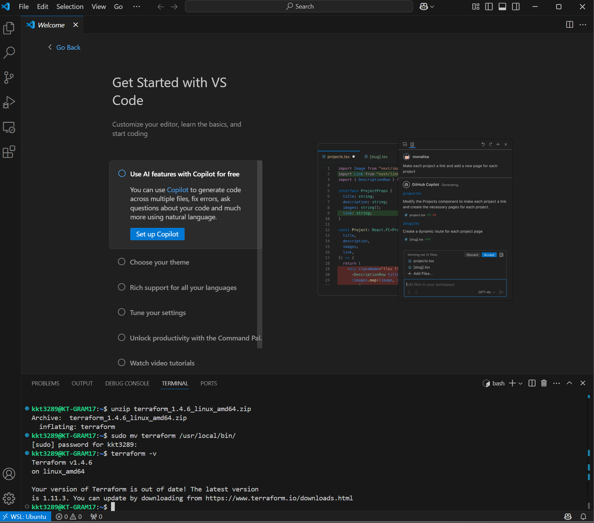

# Terraform, Ansible 인프라 설치 및 구축

## 참고 사이트

https://developnote-blog.tistory.com/170

https://developnote-blog.tistory.com/entry/AWS-EC2-Kubernetes-Cluster-%EC%84%A4%EC%B9%981-Kubeadm-containerd-%EC%84%A4%EC%B9%98

https://github.com/alicek106/aws-terraform-kubernetes

# 🌐 WSL2 + VS Code + Terraform 기반 AWS Kubernetes 인프라 구성 가이드

## 1. 개요

Terraform을 사용해 AWS EC2 기반의 쿠버네티스 클러스터를 구성하고자 할 때, **Windows 환경에서는 WSL2(Windows Subsystem for Linux 2)** 를 통해 리눅스 기반 도구 환경을 구축하는 것이 매우 중요하다. 특히 Kubespray와 Ansible 등은 리눅스 기반 도구이므로 Windows PowerShell 단독으로는 안정적으로 수행하기 어렵다.

---

## 2. 권장 아키텍처 및 워크플로우

### ✅ 코드는 **VS Code**에서 작성

### ✅ 명령 실행은 **WSL2 터미널**에서 실행

- VS Code의 `Remote - WSL` 확장을 이용하여 WSL 내부의 Terraform 및 Ansible 프로젝트를 바로 열 수 있음
- 코드를 작성한 후, WSL 터미널에서 `terraform apply`, `ansible-playbook`, `kubectl` 등의 명령을 실행

---

## 3. 개발 환경 구성 절차

### 3.1 WSL2 설치 및 Ubuntu 환경 구성

```powershell
wsl --install
```

- Ubuntu 22.04 설치 (Microsoft Store)

### 3.2 VS Code 연동

- VS Code Extension: **Remote - WSL** 설치
- `WSL: Ubuntu` 환경에서 프로젝트 폴더 오픈
- git clone 하기

---

### 3.3 Terraform 설치 (WSL Ubuntu 내부)

```bash
sudo apt update && sudo apt install -y wget unzip
wget https://releases.hashicorp.com/terraform/1.4.6/terraform_1.4.6_linux_amd64.zip
unzip terraform_1.4.6_linux_amd64.zip
sudo mv terraform /usr/local/bin/
terraform -v
```



---

### 3.4 AWS CLI 설치 및 자격 설정

### aws cli 설치

https://docs.aws.amazon.com/ko_kr/cli/latest/userguide/getting-started-install.html

```
curl "https://awscli.amazonaws.com/awscli-exe-linux-x86_64.zip" -o "awscliv2.zip"
unzip awscliv2.zip
sudo ./aws/install
aws --version

# aws 액세스키, 시크릿키 입력
aws configure
```


- 개발 용 유연한 IAM 사용자 권한 부여 - 추후 보안을 위해 최소권한 원칙 적용되어야 함(ex: FULLAcess 제거)

하단은 임시 개발용 Full 권한
    
    
    
- 커스텀 IAM, fitpt-Terraform-FullAccess
    
    ```json
    {
      "Version": "2012-10-17",
      "Statement": [
        {
          "Sid": "NetworkAndCompute",
          "Effect": "Allow",
          "Action": [
            "ec2:*",
            "elasticloadbalancing:*"
          ],
          "Resource": "*"
        },
        {
          "Sid": "DatabaseAndCache",
          "Effect": "Allow",
          "Action": [
            "rds:*",
            "elasticache:*"
          ],
          "Resource": "*"
        },
        {
          "Sid": "StateStorageAndImage",
          "Effect": "Allow",
          "Action": [
            "s3:*",
            "ecr:*"
          ],
          "Resource": "*"
        },
        {
          "Sid": "DnsAndSslCertificate",
          "Effect": "Allow",
          "Action": [
            "route53:*",
            "acm:*"
          ],
          "Resource": "*"
        },
        {
          "Sid": "SSMAccess",
          "Effect": "Allow",
          "Action": [
            "ssm:*"
          ],
          "Resource": "*"
        },
        {
          "Sid": "IAMAccess",
          "Effect": "Allow",
          "Action": [
            "iam:*"
          ],
          "Resource": "*"
        }
      ]
    }
    
    ```
    
    
    
- 액세스 키 생성하기
    
    
    
    
    
    
    
    
    
    - 세팅이 완료된 경우에는 `cat ~/.aws/credentials` 의 Default쪽에 설정되어 있는지 확인
    
    ```bash
    $ cat ~/.aws/credentials
    [default]
    aws_access_key_id = AKIA2xxxxxxxxx
    aws_secret_access_key = Wxxxxxxxxxxxxxxxxxxxxxxxxxx
    ```
    
    - Terraform 작업용: `aws configure 설정`
    - EC2 SSH 접속용: **`.pem` 키 또는 `.pub` 등록을 통한 key pair 반드시 필요**
    - 
    
    | Amazon AWS | ap-northeast-2 | oracular | 24.10 | amd64 | hvm-ssd-gp3 | 20250430 | [ami-040135cc57278049b](https://console.aws.amazon.com/ec2/home?region=ap-northeast-2#launchAmi=ami-040135cc57278049b) |
    | --- | --- | --- | --- | --- | --- | --- | --- |
    - 현재 IAM 사용자 누구인지 확인
    
    ```bash
    $ aws sts get-caller-identity
    {
        "UserId": "AIDxxxxxxxxxxxxxxxx"
        "Account": "6xxxxxxxxxxx",
        "Arn": "arn:aws:iam::69xxxxxxxxxxxxx:user/fitpt-terraform-admin"
    }
    ```
    

```bash
curl "https://awscli.amazonaws.com/awscli-exe-linux-x86_64.zip" -o "awscliv2.zip"
unzip awscliv2.zip
sudo ./aws/install
aws configure
```

> 입력값은 IAM에서 발급한 Access Key, Secret Key, Region (ap-northeast-2) 등
> 

---

### 3.5 SSH 키 생성

```bash
mkdir -p ~/infra/keys
ssh-keygen -t rsa -N "" -f ~/infra/keys/tf-fitpt
```

- `.pub` 파일은 Terraform에서 KeyPair에 사용

---

## 4. Terraform 실행

```bash
cd ~/infra/terraform
terraform fmt
terraform init
terraform plan
terraform apply
terraform destroy
```

이 과정을 통해 VPC, Subnet, IAM, EC2 인스턴스, KeyPair 등이 자동으로 생성된다.

- terraform inti
    
    
    
- terraform apply
    
    
    

- EC2 생성 확인
    
    
    

- terrafrom destroy
    
    
    
    
    

---

## 5. 이후 작업 (옵션)

- `ansible-playbook` 으로 패키지 설치 및 kubespray 기반 클러스터 구성
    - 
        
        ## ✅ 해결 방법: Ansible 설치
        
        ### 🔧 우분투 기준 설치 명령어
        
        ```bash
        sudo apt update
        sudo apt install -y ansible-core
        ```
        
        또는 full package가 필요할 경우:
        
        ```bash
        sudo apt install -y ansible
        ```
        
        > ansible-core: 핵심 CLI 도구만 설치 (권장)
        > 
        > 
        > `ansible`: 포함된 다양한 플러그인/기본 모듈 포함 (패키지 크기 큼)
        > 
        
        ---
        
        ### 🔍 설치 후 확인
        
        ```bash
        ansible --version
        ```
        
        출력 예시:
        
        ```
        ansible [core 2.15.3]
        ```
        
- `kubectl get nodes`로 K8s 클러스터 확인
- 모니터링, 로그 수집, 자동화 작업으로 확장 가능

---

# 주의 복붙한 .pem 키 오류로 접속 안될시

- 리눅스 보안키 보안정책으로 600 으로 유저에게만 읽기, 쓰기 권한 있어야 정상 사용 가능

```bash
cd keys/

chmod 600 tf-fitpt
```

# 인프라 모듈 실행 방법(로컬 WSL 내 설치 법)

- 패키지 설치
    
    ```bash
    sudo apt update
    sudo apt install -y python3-pip build-essential python3-dev libffi-dev libssl-dev
    
    python3 --version
    
    # 버전에 따른 가상 환경 설치
    Python 3.10.12
    python3.12
    
    sudo apt install -y python3.12-venv
    
    # 가상환경 권장
    python3 -m venv .venv
    source .venv/bin/activate
    
    pip install -r requirements.txt
    ```
    

- **Terraform 적용**
    
    ```bash
    cd terraform
    
    terraform init
    
    # 작성 테라폼 계획 보기
    terraform plan
    
    terraform apply
    
    # 서버 종료 시
    terraform destroy
    
    ```
    
    
    

- 수동 SSM 접속 방법
    
    ```bash
    # pem 키로 Bastion host 접속
    cd keys
    
    ssh -i <키 이> <계정 명>@<ip 주소>
    ```
    
    ```bash
    # SSM 로 접속
    aws ssm start-session --target <인스턴스 아이디>
    ```
    

- **Ansible 실행 순서**
    
    ```bash
    cd infra/ansible
    
    # 실행 쉘 스크립트 실행
    chmod +x 0-setup.sh
    
    # 실행
    ./0-setup.sh
    
    # 가상 환경 접속
    source .venv/bin/activate
    ```
    
    ```bash
    # 1. 베스천 호스트 확인 (SSH 접속)
    ansible-inventory -i hosts/ssh/inventory.aws_ec2.yaml --list
    
    # output
    "all": {
            "children": [
                "ungrouped",
                "aws_ec2",
                "fitpt_gym001_bastion",
                "bastion"
            ]
        },
        "aws_ec2": {
            "hosts": [
                "fitpt-gym001-bastion"
            ]
        },
        "bastion": {
            "hosts": [
                "fitpt-gym001-bastion"
            ]
        },
        "fitpt_gym001_bastion": {
            "hosts": [
                "fitpt-gym001-bastion"
            ]
        }
    }
    ```
    
    ```bash
    # 2. 베스천 호스트에 SSM Agent 설치
    ansible-playbook \
      -i hosts/ssh/inventory.aws_ec2.yaml \
      1-setup-bastion.yaml \
      -u ubuntu -c ssh --private-key ../keys/tf-fitpt
    ```
    
    ```bash
    # 3. 프라이빗 인스턴스 확인 (SSM 접속)
    ansible-inventory -i hosts/ssm/inventory.aws_ec2.yaml --list
    
    #output
        "all": {
            "children": [
                "ungrouped",
                "aws_ec2",
                "bastion",
                "app",
                "monitor"
            ]
        },
        "app": {
            "hosts": [
                "i-0bf9fcd562ff589d9"
            ]
        },
        "aws_ec2": {
            "hosts": [
                "i-009d282150c1121ae",
                "i-0bf9fcd562ff589d9",
                "i-0ecddbb237f168fbf"
            ]
        },
        "bastion": {
            "hosts": [
                "i-009d282150c1121ae"
            ]
        },
        "monitor": {
            "hosts": [
                "i-0ecddbb237f168fbf"
            ]
        }
    }
    ```
    
    ```bash
    # 4. 프라이빗 인스턴스 관리
    ansible-playbook -i hosts/ssm/inventory.aws_ec2.yaml 2-setup-app.ymal
    ```
    
    ```bash
    # 5. 프라이빗 monitor 인스턴스 관리
    ansible-playbook -i hosts/ssm/inventory.aws_ec2.yaml 3-setup-monitor.yaml
    ```
    

- SSM 세션 기반 포트 포워딩
    
    SSM 에이전트를 이용해 로컬 머신의 포트를 모니터링 인스턴스의 포트에 터널링하는 방법
    
    AWS CLI v2와 Session Manager Plugin이 설치되어 있어야 함
    
    ```bash
    # 예: Prometheus(9090) 터널링
    aws ssm start-session \
      --target i-0ecddbb237f168fbf \
      --document-name AWS-StartPortForwardingSession \
      --parameters '{"portNumber":["9090"],"localPortNumber":["9090"]}'
    
    # 예: Grafana(3000) 터널링
    aws ssm start-session \
      --target i-0ecddbb237f168fbf \
      --document-name AWS-StartPortForwardingSession \
      --parameters '{"portNumber":["3000"],"localPortNumber":["3000"]}'
    
    ```
    
    
    
    